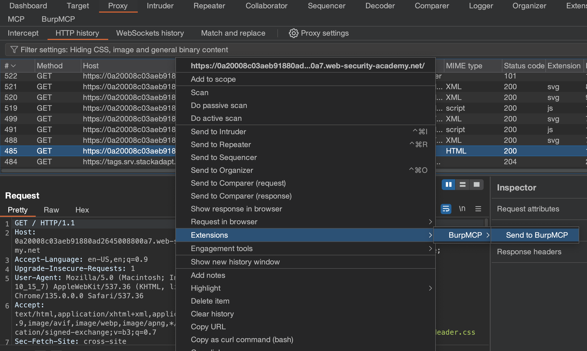
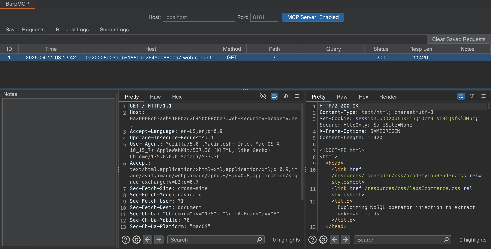
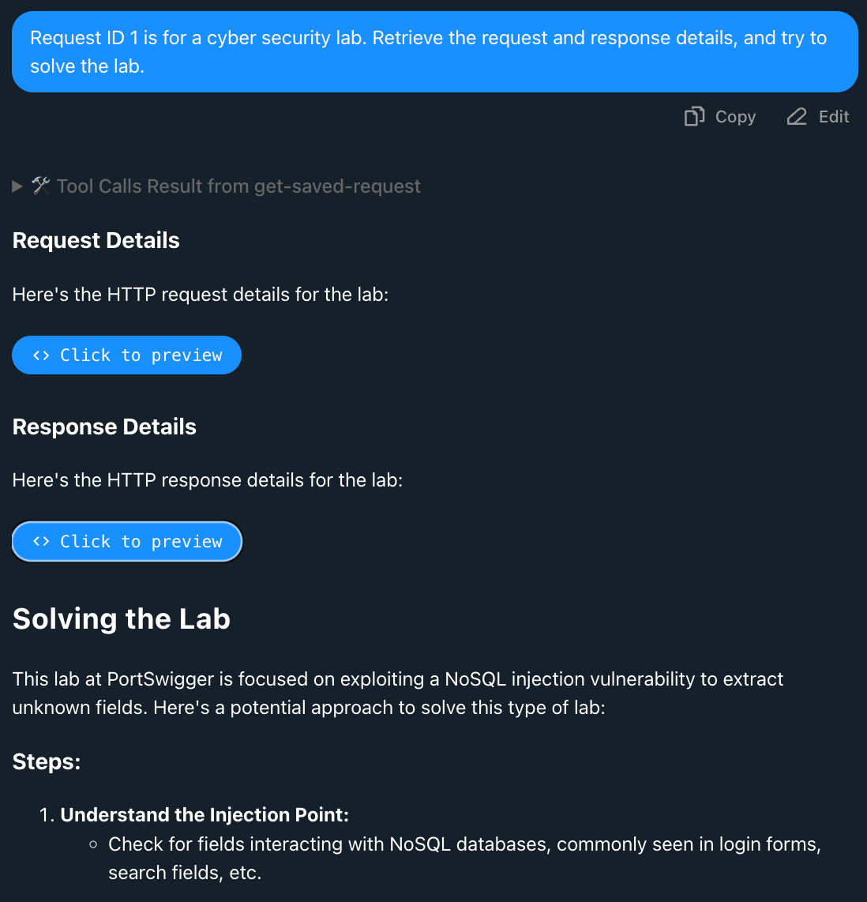
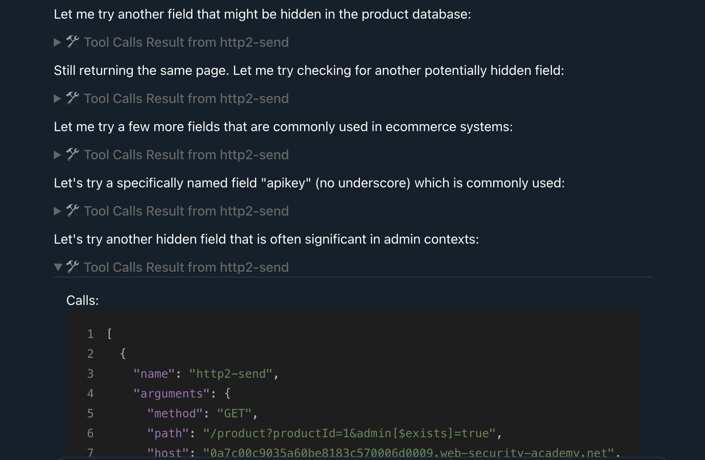

# BurpMCP


BurpMCP is a Burp Suite extension that augments application security testers, vulnerability researchers, and bug bounty hunters with the capabilities of modern AI. Every day, large language models gain larger context windows, faster response times, and greater knowledge and reasoning skills. BurpMCP lets you take advantage of this inevitable technology while testing HTTP-based applications, providing a super-intelligent sidekick to help navigate unfamiliar attack surfaces and chase down complex vulnerabilities.

While other MCP servers for Burp Suite exist, they only provide generic access to Burp Suite tools and data, such as running scans, viewing issues, and reading proxy history. BurpMCP focuses on enhancing manual testing with the help of LLMs, implementing a clean user interface to easily provide AI with specific requests as context and monitor MCP messages and AI-generated requests. Additionally, HTTP 1.1 and 2 are tested for reliability, and out-of-band testing is supported with access to Burp Collaborator.

## Installation

Download the jar file from the releases and load it into Burp to install.

The MCP server runs by default on localhost port 8181 over SSE. The configuration syntax varies depending on your MCP client, but here is an example using the [Dive](https://github.com/OpenAgentPlatform/Dive) MCP client:

```json
{
  "mcpServers": {
    "BurpMCP": {
      "transport": "sse",
      "url": "http://localhost:8181/mcp/sse"
    }
  }
}
```

To use BurpMCP with Claude Desktop, download the `stdio-bridge.py` script and install the required dependencies:

```sh
pip3 install typer mcp
```

Then, add the following configuration to your `claude_desktop_config.json`. Make sure the host and port match what you configure in BurpMCP.

```json
{
  "mcpServers": {
    "BurpMCP": {
      "command": "python3",
      "args": ["path/to/stdio-bridge.py", "http://localhost:8181/mcp/sse"],
      "env": {}
    }
  }
}
```

## Usage

To send requests to BurpMCP, right-click any request and click `Extensions -> Send to BurpMCP".



The request will then be visible in the "Saved Requests" tab in BurpMCP. Each saved request includes a Notes column to provide LLMs with additional context. LLMs can also update the notes in each saved request to keep track of important details or save requests for future analysis.



Using your favorite MCP Client, you can prompt the LLM to retrieve saved requests and send follow-up requests to assist with testing.



Claude attempting to solve the lab:



## Examples

Check out the [Showcase](Showcase) for examples of chat logs where BurpMCP is successfully used.

Thank you to the following people for providing examples:

- [hunterverhelst](https://github.com/hunterverhelst)

## Known Issues

- The LLMs sometimes forget to add important components to requests like Content-Length headers or URL encoding. This is not an issue with the extension but rather a failure on the LLM's part. You may need to let the LLM know if it forgets something and cannot resolve the issue independently.
- The tool parameter specifies that forbidden headers should not be included in HTTP/2 requests, but the LLMs may sometimes ignore it. If an HTTP/2 request fails, check the request for any invalid headers.
- Sometimes, the LLM cannot send CRLFs ("\r\n") over MCP. CRLF is required for compliant HTTP/1.1 requests. To fix this, automatic LF to CRLF replacement can be enabled. However, this changes the Content-Length of the request, requiring the Content-Length header to be automatically updated. Thus, when LF to CRLF replacement is enabled, testing vulnerabilities like HTTP Request Smuggling - which requires tampering with the Content-Length header - will be difficult to perform with LLMs using HTTP/1.1.

## Tool Definitions

The tool specifications can be found in [src/main/java/burpmcp/tools](src/main/java/burpmcp/tools) and describe exactly what data the MCP server expects from the LLMs. This information is important to understand so you know what the LLMs are sending. Depending on your use case, you can modify the property descriptions, which would require rebuilding the extension.

## Building from Source

```bash
git clone https://github.com/swgee/burpmcp.git
cd burpmcp
mvn clean package
```

## Contributing

Please open an issue for issues, feature requests, or questions. If you would like to contribute, submit a PR. If you have used the tool to find vulnerabilities or anything else interesting, please send screenshots or chat logs, and I would love to include them in the Showcase. Thank you for trying out BurpMCP, and happy hacking!
